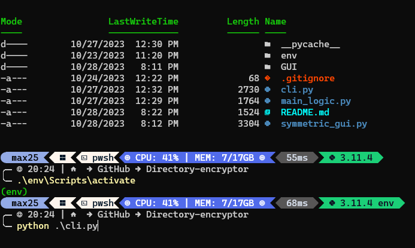
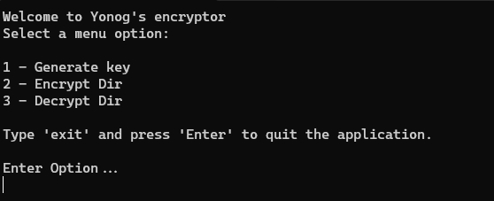

# Directory-encryptor
Encrypts all files under a specified directory using symmetric encryption.
You may use this program at your own discretion and no responsibility will be taken for missing files/data.

It is NOT RECOMMENDED to use this in your own personal machine where you keep sensitive data.

The logic and functionality are in the main_logic.py file, while the GUI-related stuff is in the GUI folder.

The GUI's source code is in the symmetric_gui.py file.
To run the program, without having to set an environment and deal with dependencies download the exe file.

If you downloaded the source code and got your environment working, save the files in the same directory and run symmetric_gui.py.

Click the 'Generate key' button to generate a key to encrypt/decrypt data with, then find a path in your computer/network
you want to encrypt and enter it to the text box beside the encrypt/decrypt buttons respectively.


Then enter the generated key to the pop-up on the screen, hit apply (once) and your data is now encrypted!


You can also run the cli version by running this command for windows:
```
python cli.py
```
or for mac/linux:
```
python3 cli.py
```
from the files' directory.






Be sure to save the key to prevent data loss.
Use at your own risk.
